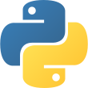
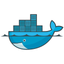
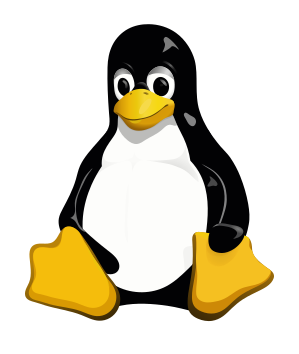
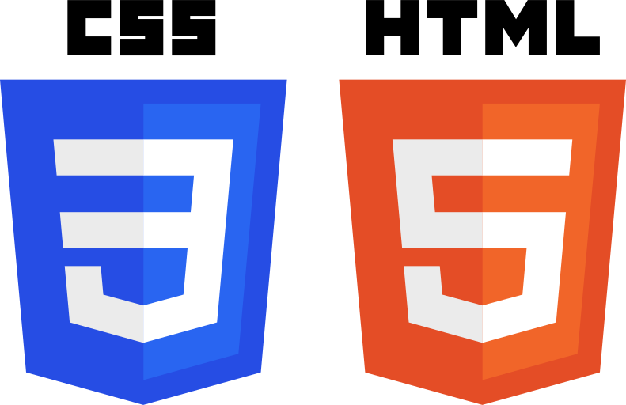

# :wave: Hello there! I'm Kai "Devrim" McCormick</h1>
:smile: I am a High School Junior in San Jose, California! I love to make useful tools for everyone and also making stuff that will benefit the future!</h3>

  
  

* :office:  I'm currently on my Homelab and Self-Hosting community projects.
* 🗣️  I am a huge One Piece fan and will talk to you for hours about One Piece.
* :newspaper:   Read my **[Blog](https://blog.devrim.tech)**
* :seedling:   I'm currently learning **Ansible and Terraform**
* :speech_balloon:   I like to talk about **Servers** and **Backend**
* 🐧:   Contact me directly on my Discord **Kai#5748**
* 📬:   Email me about anything at kai@devrim.tech
* :bird:  Follow me on [Twitter](https://twitter.com/devrimkai)

 

<h2 align="left">Favorite Tech</h2>

> Tools, languages, and other things that I like to work with.

<table>
  <tr>
    <td align="center" width="96">
        
       C# .Net Core
    </td>
    <td align="center" width="96">
        
       Python
    </td>
    <td align="center" width="96">
        
       TypeScript
    </td>
    <td align="center" width="96">
        
       JavaScript
    </td>
    <td align="center" width="96">
        
       Docker
    </td>
    <td align="center" width="96">
        
       Debian
    </td>
    <td align="center" width="96">
        
       Linux
    </td>
    <td align="center" width="96">
        
       HTML and CSS
    </td>
  </tr>
</table>

<!-- links -->
   

<a href="https://github.com/abhisheknaiidu/awesome-github-profile-readme"> :point_left: Link to Original Version</a>
